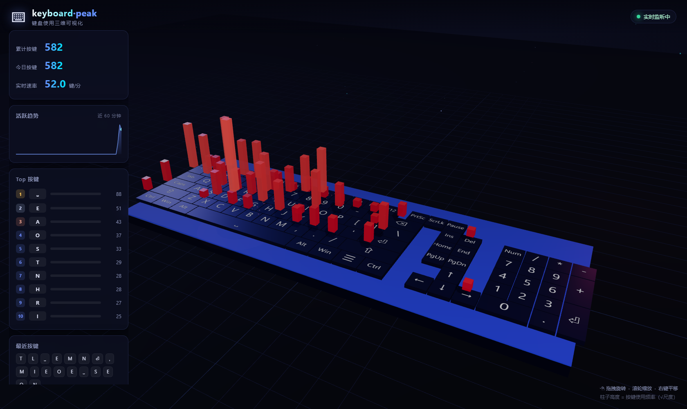

# keyboard-peak

> 后台记录每一个键盘按键，并用 3D 立体键盘实时可视化展示 —— 每次按键都会让对应键帽上方的数据柱拔地而起、动态生长。



## ✨ 功能特性

- **全局后台采集**：基于 pynput 的低层全局钩子，无论焦点在哪个窗口，每一次按键都被记录。
- **104 键完整布局**：主键区 + 功能键区 + 导航编辑键 + 数字小键盘，每个物理键都有对应的统计。
- **3D 立体可视化（Three.js）**：
  - 每个按键上方一根**高耸的数据柱**，高度 = 按键频率（√ 尺度，避免悬殊直方图失真）；
  - **渐进成长动画**：柱子平滑长高，新按键会看到柱子在眼前拔起；
  - **热力着色**：蓝 → 青 → 黄 → 红 渐变，频率越高越「热」；
  - **键帽按压动画**：被按下的键帽瞬间下沉回弹；
  - **按键迸发粒子** + **扩展涟漪环** + **漂浮计数精灵**；
  - **摄像机自动环绕** + 鼠标拖拽/滚轮/右键平移自由操控；
  - 星空粒子背景、霓虹键盘底座、动态彩色补光。
- **实时统计面板**：
  - 累计按键 / 今日按键 / 实时速率（键/分）；
  - 近 60 分钟活跃趋势折线图；
  - Top 10 高频按键排行；
  - 最近按键流水条。
- **数据跨会话累积**：自动保存 JSON，重启软件历史数据不丢失。

## 🚀 快速开始

```bash
# 1. 安装依赖（建议 Python 3.10+）
pip install -r requirements.txt

# 2. 一条命令启动：后台开始监听 + 自动打开可视化页面
python start.py

# 3. 高级选项
python start.py --port 9000      # 指定端口
python start.py --no-browser     # 不自动打开浏览器
python start.py --data D:/my/keylog.json   # 自定义数据文件
python start.py --demo           # 演示模式：模拟按键，不碰真实键盘
```

按 `Ctrl+C` 停止记录，数据自动落盘保存。

## 🧪 测试

```bash
python tests/test_server.py      # 服务 & SSE 联调测试
python tests/test_listener.py    # 全局钩子采集测试（会向系统注入少量按键）
python tests/screenshot.py <url> <out.png> [等待毫秒]   # 可视化截图（需 playwright）
```

## 📁 项目结构

```
keyboard-peak/
├── start.py            # 一键启动入口（监听 / 演示 双模式）
├── requirements.txt    # 依赖：pynput
├── kpeak/
│   ├── keymap.py       # 104 键布局 + Windows VK 映射 + 按键归一化
│   ├── collector.py    # pynput 全局键盘钩子
│   ├── store.py        # 数据模型 + JSON 跨会话持久化 + 每日统计
│   ├── server.py       # HTTP 静态服务 + SSE 实时推送 + 快照接口
│   └── config.py       # 全局配置
├── web/
│   ├── index.html      # 可视化页面
│   ├── css/style.css   # 界面样式
│   ├── js/             # 前端模块（场景/键盘/特效/面板/入口）
│   └── vendor/         # Three.js 运行时（本地化，无需外网）
├── tests/              # 联调测试与截图脚本
├── docs/               # 开发截图
└── data/               # 运行时按键数据（自动生成，不入库）
```

## 🛠 技术栈

| 层 | 技术 |
| --- | --- |
| 采集 | Python + [pynput](https://pypi.org/project/pynput/)（全局低层键盘钩子） |
| 推送 | Python 标准库 HTTP 服务 + **SSE**（Server-Sent Events） |
| 持久化 | 本地 JSON（原子写入），跨会话累计 |
| 可视化 | [Three.js](https://threejs.org/) r160（本地化，离线可用） |
| 交互 | OrbitControls（自动环绕 + 拖拽/缩放/平移） |

## 📌 说明

- 数据文件默认在 `data/keylog.json`，**为隐私考虑请勿外传**；「演示模式」使用独立文件 `data/demo_keylog.json`，不会与真实数据混淆。
- 全局钩子需要系统权限：Windows 上监听进程以普通用户运行即可，但**杀毒软件可能会询问是否允许钩子注入**，请选择允许。
- 数据记录的是物理按键（不区分 Shift 组合后的字符），更贴近「键盘使用情况」统计。

## 📄 License

[MIT](LICENSE) © 2026 Mizuki